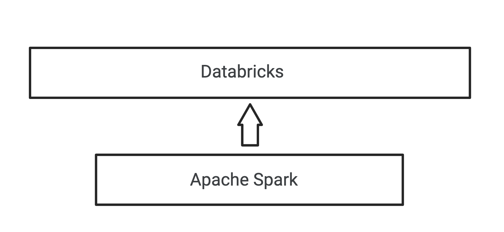
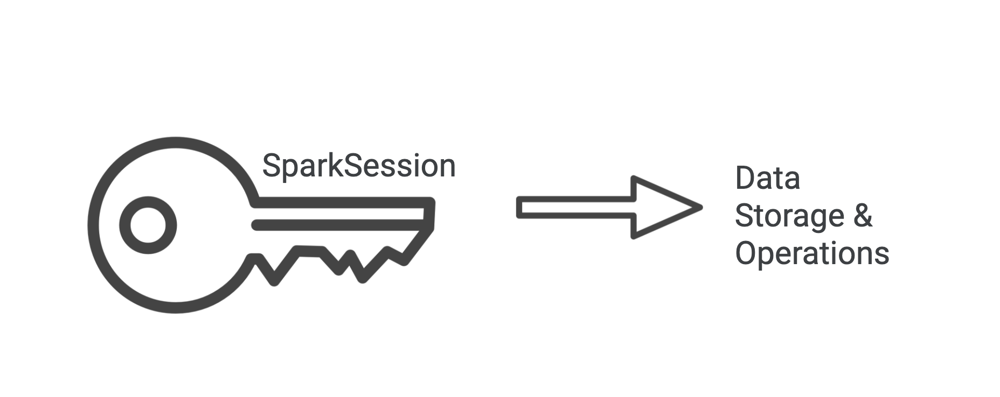

# Apache Spark Quickstart


## Overview

In this lesson you will become familiar with the basics of Apache Spark so that you can start using the functionality right away. This lesson will focus on using the Python programming language (PySpark API) however in addition to Python, Spark also has API’s available in Scala and Java.

## Learning Outcomes

After completing this lesson you will be able to:

1. Describe what Apache Spark is and some fundamental use cases
1. Recognize what an Apache Spark Session object is
1. Identify a key Apache Spark data structures called a DataFrame
1. Execute basic operations to manipulate DataFrames

## What is Apache Spark?

What is Apache Spark and how does it work with Databricks? 

In a nutshell Apache Spark or Spark for short, is an open-source [unified analytics engine for large scale data processing](https://spark.apache.org/). If you've ever worked with large datasets you know that speed and efficiency can become a difficult issue to address as your project scales. Spark helps take the headache out of piecing together a myriad of different techniques and tools to address these complex challenges by providing a powerful and easy to use framework that lets you quickly perform large data processing tasks and utilize the power of distributed computing. 

Imagine you are creating an analytics system that handles terabytes of video streaming data or you need to create a scalable sentiment analysis pipeline for massive amounts of marketing data. Spark provides all the functionality you need and more to get your ideas quickly up and running. 

Databricks is a [Unified Analytics Platform](https://databricks.com/product/data-lakehouse) that is built on top of Spark. Databricks provides a user friendly environment that lets you easily develop and collaborate with tools like Spark. If you open a Databricks notebook which behaves similarly to a Jupyter notebook you can easily access all the tools Databricks has to offer including Apache Spark.



> **Check Your Understanding:** Think of some other scenarios and use cases where Apache Spark could be applied in addition to the ones mentioned above.

## Spark Session

If you type the word `spark` in a notebook cell and then run it you will see output that describes a [`SparkSession` object](https://spark.apache.org/docs/latest/api/scala/org/apache/spark/sql/SparkSession.html) (You can also verify this using Python's built-in `type()` function). 

```python
type(spark)
```

`spark` gives you access to an object that will unlock all of Sparks functionality within the context of a Databricks notebook. It includes a ton of different functionality but for now we are just going to focus on the basics. Think of the `SparkSession` object like a key to much of the data manipulation resources that Spark has to offer.




## DataFrame

### Creating a DataFrame from Data

In order to easily store and manipulate data Apache Spark uses a data structure called a DataFrame. [DataFrame in Apache Spark](https://spark.apache.org/docs/latest/sql-programming-guide.html) is very similar to the idea of a DataFrame in [pandas and R](https://pandas.pydata.org/docs/reference/api/pandas.DataFrame.html). You can think of it like a programmatic representation of an excel sheet or database table where data is organized in rows and named columns. 

|  | name | age | favorite_food |
|---|------|-----|---------------|
| 1 | Jess | 30  | curry         |
| 2 | Tara | 1   | peanuts       |
| 3 | Nova | 6   | chicken       |

However, this data structure is much more powerful because under the hood your data is distributed which makes it very fast and optimized for large amounts of data compared to a typical pandas DataFrame. The cool part is that you can get all of this functionality very easily and not have to worry about the details if you don't want to. In your notebook type the code below, before you run it what do you think this line of code does?

```python
iot_df = spark.read.json("/databricks-datasets/iot/iot_devices.json")
iot_df.first()
```

Databricks provides several example data files you can use to learn. In the example above we use the Internet of Things (IOT) JSON data file which contains examples of data you might get from an IOT device such as device name or battery level. You'll notice that we first used the `spark` command which gave us a `SparkSession` object. From there we were able to access to spark’s file reading functionality using the `read.json()` method (there are several [other ways to read and create data](https://spark.apache.org/docs/2.3.0/sql-programming-guide.html#data-sources) using Spark). This method will read in a JSON file and return a DataFrame object which we store in the variable `iot_df`. After you run this command imagine something like this table exists in memory:

**IOT Device Readings**

| battery_level | cn            | humidity | ... |
|---------------|---------------|----------| --- |
| 8             | United States | 50       | ... |
| 7             | Norway        | 70       | ... |


On the second line we use the  `first()` method of the DataFrame. As the output indicates this returns the first `Row` of the object. 

> **NOTE:** DataFrame is built upon the older Apache Spark data structure called a [Resilient Distributed Dataset (RDD)](https://spark.apache.org/docs/1.6.2/api/java/org/apache/spark/rdd/RDD.html). In addition to this Spark also includes a data structure called a [DataSet](https://spark.apache.org/docs/latest/api/java/index.html?org/apache/spark/sql/Dataset.html) that is not available in Python due to being strongly typed. As you dive deeper into Spark it will become more important to become familiar with these data structures and [how they compare to DataFrame](https://databricks.com/blog/2016/07/14/a-tale-of-three-apache-spark-apis-rdds-dataframes-and-datasets.html) but for now we will focus on just DataFrame. 

### Manipulating a DataFrame

Now that we have our data stored in a DataFrame we can use all of its powerful functionality to view and manipulate our data.

Let's say we want to use our IOT data and get information on all the devices that gave a humidity level reading of greater than 50%. We can use the `filter` method to achieve this and other conditional based filtering queries. `filter` takes in a condition that can be expressed using SQL like syntax (similar to how it's done in pandas).

```python
#get all the entries where the humidity reading is greater than 50%
results = iot_df.filter(iot_df.humidity > 50)
#display the first 5 rows of the resulting DataFrame
results.head(5)
```

What if we want to count the number of device readings by country? We can use a combination of `groupby()` and `count()` to achieve this.

```python
#count the number of device readings by country
results = iot_df.groupBy("cn").count()
#show the results in a nice table
display(results)
```

This is just a small peek at the data manipulation functionality provided by Apache Spark and DataFrames. To learn more check out the [DataFrame documentation](https://spark.apache.org/docs/1.6.3/api/java/org/apache/spark/sql/DataFrame.html). A lot of the functionality provided is very similar to pandas DataFrames (you can even convert between them!). 

> **Check Your Understanding:** Use your DataFrame to get all entries in the IOT data where the temperature reading is less than 30 degrees Celsius. 

> **Challenge Problem:** What if you want to get all entries where the temperature reading is less than 30 degrees Celsius AND the country is Japan? Check out [this resource](https://sparkbyexamples.com/spark/spark-dataframe-where-filter/) to learn how to combine multiple conditions.  

## Summary

 In this lesson you learned:

 1. What Apache Spark is
 1. How to use a Databricks notebook to unlock Apache Spark functionality
 1. How to create and manipulate DataFrames

## Next Steps

This is just the beginning of your Apache Spark adventure! Next up you will learn more about DataFrames, transformations, actions, and DataSets in the context of Python and other language API's. Later on you will take things to the next level and learn how to use Apache Spark's powerful streaming and Machine Learning functionality as well as how to utilize SQL and Graph capabilities. 

A large portion of these amazing features are all built upon the foundational skills you have been exposed to in this lesson, namely, using methods available via a `SparkSession` object and storing and manipulating data in distributed data structures like DataFrame! 
